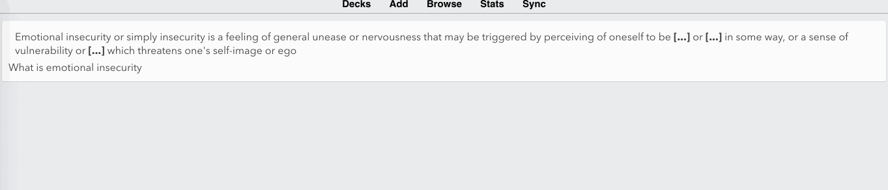
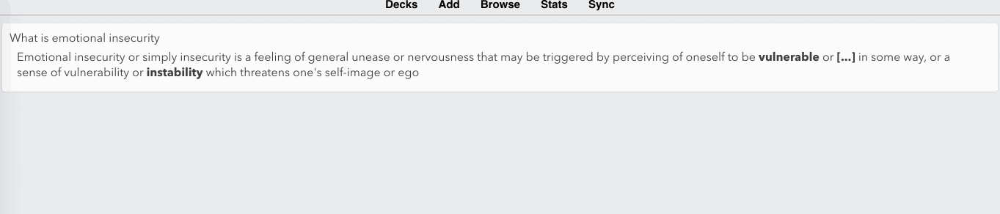

## What is this

Fix the anki cards exported by MarginNote3 (up to 3.4.3). The problems I suffer are:
- Only one anki card is generated, even if there are multiple clozes.
- Inconsistent & confusing format of the card front / back for cards w/ clozes in the title and cards w/o.
- MN tags appear in the back of the anki card.

This script reads the contents of generated `apkg` file, and makes use of [genanki](https://github.com/kerrickstaley/genanki) package to rewrite it to a better one.

## Visual Comparison

### Original apkg imported into Anki

- title shown in bottom
- only one card for 3 clozes
- tag is shown in the back card



### Improved apkg imported into Anki



## How to use

1. Make sure python3 is installed on your Mac.
2. Install the requirements
```sh
    pip3 install -r requirements.txt
```
3. Run the script to fix the exported apkg file before importing them to anki.
```sh
./fix_mn_anki_exports.py fix /path/to/apkg
```

You'll see output like this:
```
[09/14/2019 23:00:47][fix_mn_anki_exports]: Auto located apkg file /path/to/apkg
[09/14/2019 23:00:47][fix_mn_anki_exports]: files: ['collection.anki2', 'media']
[09/14/2019 23:00:47][fix_mn_anki_exports]: Extracted collection.anki2 to /tmp/mn-anki-exports-fix/tmprjqntj9e
[09/14/2019 23:00:47][fix_mn_anki_exports]: Loaded the model
[09/14/2019 23:00:47][fix_mn_anki_exports]: Loaded 45 notes
[09/14/2019 23:00:47][fix_mn_anki_exports]: Fixed all 45 notes
[09/14/2019 23:00:47][fix_mn_anki_exports]: Loaded deck info: deck name = 20181501542376, id = mydeck
[09/14/2019 23:00:47][fix_mn_anki_exports]: Generating output file /tmp/output.apkg
```

The improved apkg would be `/tmp/output.apkg`.
